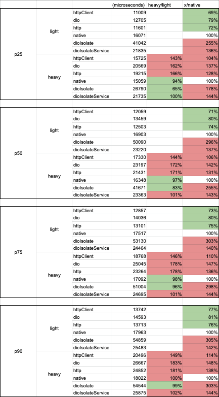

# Flutter HTTP client performance test

This test analyzes the performance impact of the load in Dart's thread over the requests from different HTTP clients.

## Environment
* Flutter 3.0.2
* Dart 2.17.3
* dio 4.0.6
* http 0.13.5
* okhttp 2.5.0

Device:
* Samsung Galaxy S22
* Android 13

HTTP Server:
* [Simple HTTP Server](https://play.google.com/store/apps/details?id=com.phlox.simpleserver)
  * Hosted by the device itself to avoid network latency impact
  * Using default settings

## The HTTP clients used in the test

### [HttpClient](https://api.dart.dev/stable/2.17.3/dart-io/HttpClient-class.html) (Flutter)

The HTTP client from dart:io lib.

**Important note**: all other Flutter HTTP clients use this one inside them.

### [dio](https://pub.dev/packages/dio) (Flutter)

A powerful Http client for Dart, which supports Interceptors, Global configuration, FormData, Request Cancellation, File
downloading, Timeout etc.

### [http](https://pub.dev/packages/http) (Flutter)

A composable, Future-based library for making HTTP requests.

This package contains a set of high-level functions and classes that make it easy to consume HTTP resources. It's
multi-platform, and supports mobile, desktop, and the browser.

### native (Android)

A solution made just for this performance test. It uses a platform channel that uses [okhttp](https://square.github.io/okhttp/) to send requests.
Each request uses a single thread from the [ExecutorService](https://developer.android.com/reference/java/util/concurrent/ExecutorService). (Android doesn't allow to make an HTTP request in the main thread).

## Test scenarios

### Light scenario

A button from a Flutter screen is pressed to start 1000 HTTP requests.
A time of 500 milliseconds is awaited before each request start.
The time for the HTTP request is measured in microseconds and stored in an array.

This process happens for each HTTP client.

### Heavy scenario

Same as **Light scenario**, but while the execution happens, a Timer increments a counter in the screen after each 200 milliseconds.
The counter increment behavior simulates things happening on Flutter while the requests are being made.

## Results

## Conclusions

* All the Flutter's HTTP clients perform better than the native's one on the light scenario.
* The native has the best performance on the heavy scenario.
* Considering just Flutter HTTP clients, the best to the worst performance order is: HttpClient -> http -> dio. That can be correlated to the amount of features these libs have.
* We can assume the native performs better on the heavy scenario because it has one extra thread to process the HTTP requests.

## Additional thoughts

Despite dio has the worst performance compared to the other Flutter's clients, it adds lots of features and improves the development experience.
Using a simpler HTTP client but adding similar features would make them perform closer to dio. 

The native solution could look a good way to go, but on this case, it is necessary to implement and maintain additional logic on native's side. 
